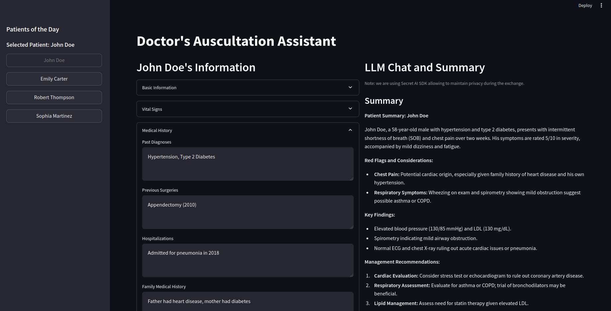
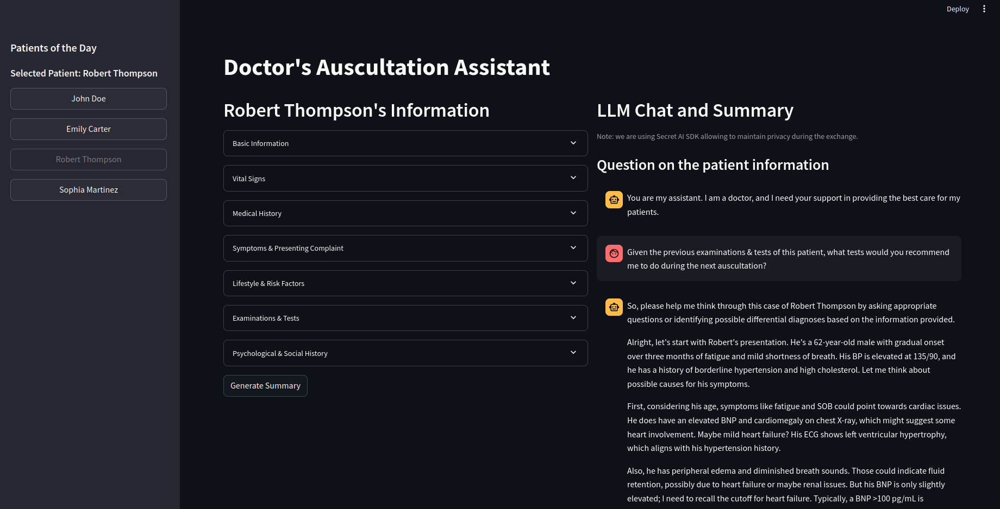

# DocAssist
> Empowering doctors with instant, confidential insights and summaries to enhance patient care and decision-making.

DocAssist provides an intuitive interface that enables doctors to efficiently monitor and manage their patients throughout the day by consolidating all patient data into a single, streamlined view. Its key feature is the integration of a private LLM agent powered by the Secret AI SDK, allowing doctors to request summarized patient information based on medical history and pose specific questions to the LLM for more detailed insights.

To ensure the highest level of privacy and data security, DocAssist leverages the Secret AI SDK, which utilizes an off-chain Confidential Computing layer built on top of the Secret Network. This approach guarantees the confidentiality of patient data while delivering powerful and accurate AI-driven assistance.

## Installation

We are using [uv as package manager](https://github.com/astral-sh/uv).

```bash 
uv venv --python 3.12
source .venv/bin/activate

uv pip install 'secret-sdk>=1.8.1' --prerelease=allow
uv pip install secret-ai-sdk
uv pip install python-dotenv
uv pip install streamlit
```

## Run the dashboard

```bash 
streamlit run src/main.py
```

# Dashboard samples





